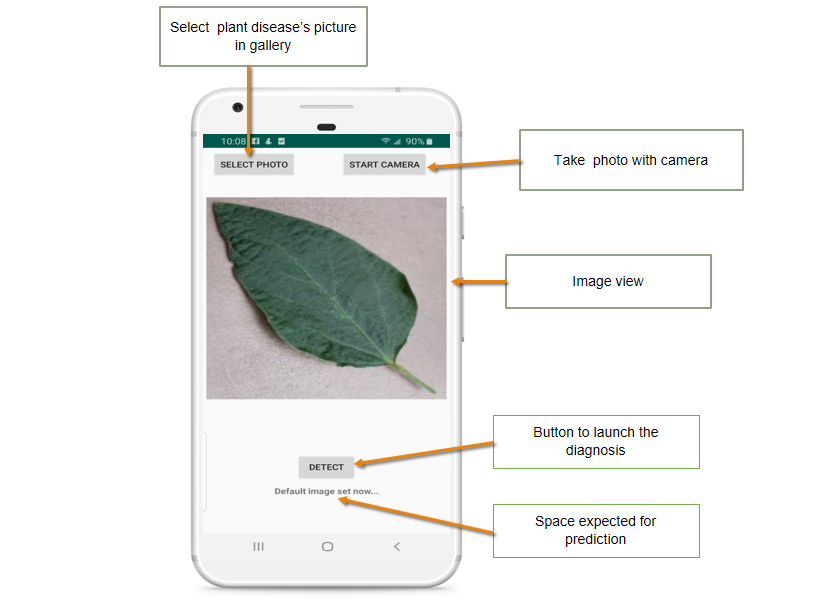
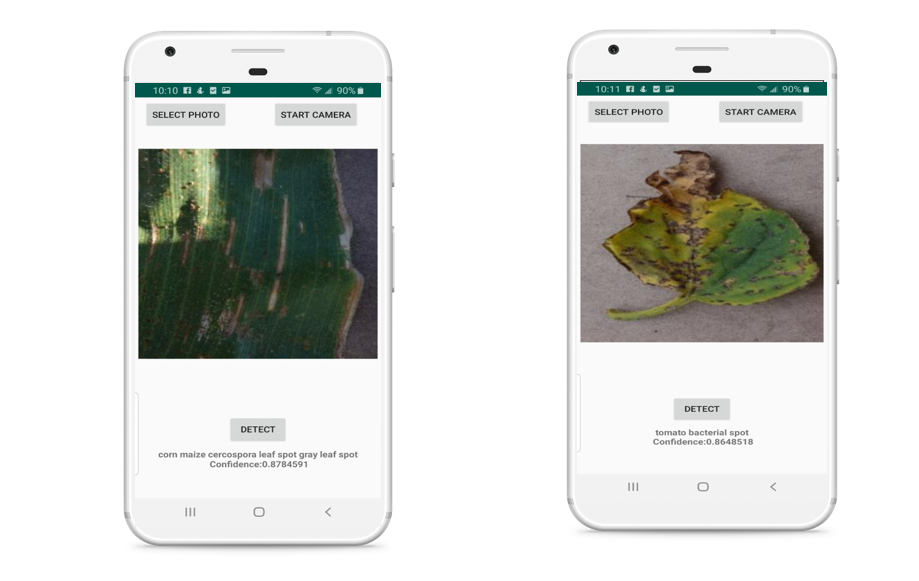

## Plant Diseases Detector
The project is broken down into multiple steps:

* Building and creating a machine learning model using TensorFlow with Keras
* Deploying the model to an Android application using TFLite
* Documenting and open-sourcing the development process

### Screenshots

### Libraries

* [Tensorflow 2.0](https://www.tensorflow.org/)
* [TensorFlow Lite ](https://www.tensorflow.org/lite)

### Programming Languages

* Python
* Kotlin

